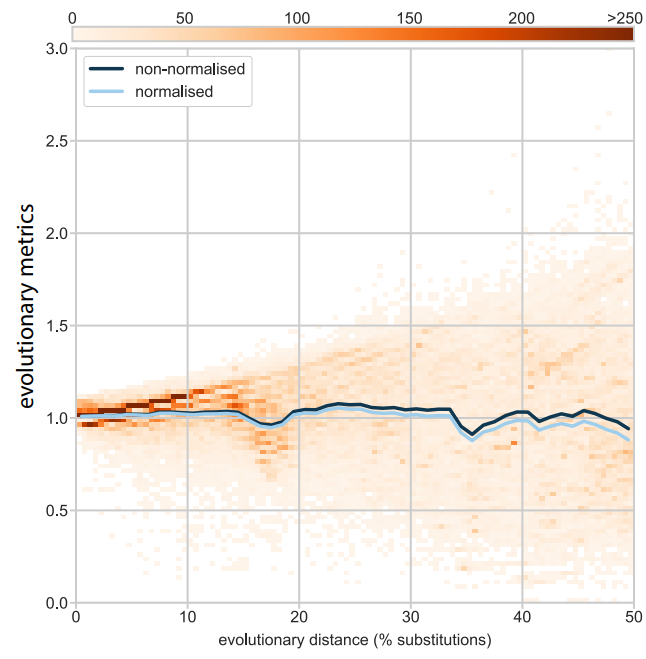
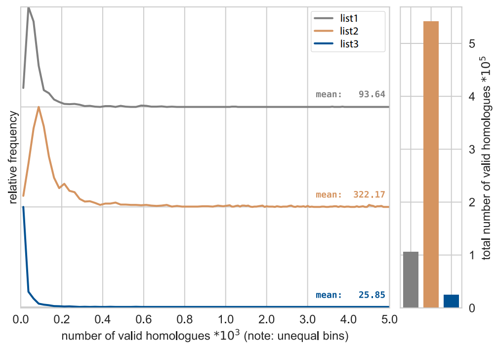
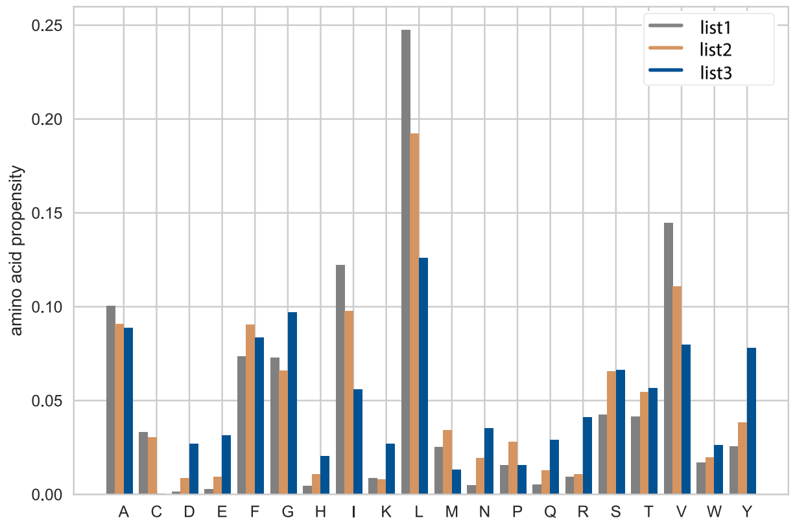
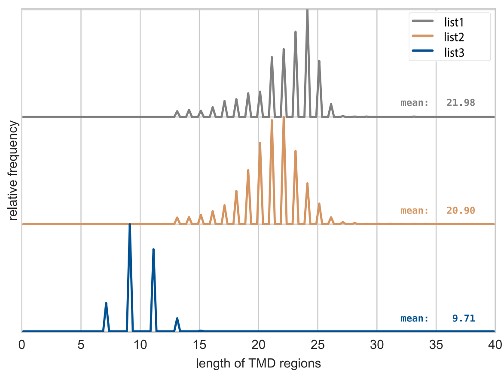
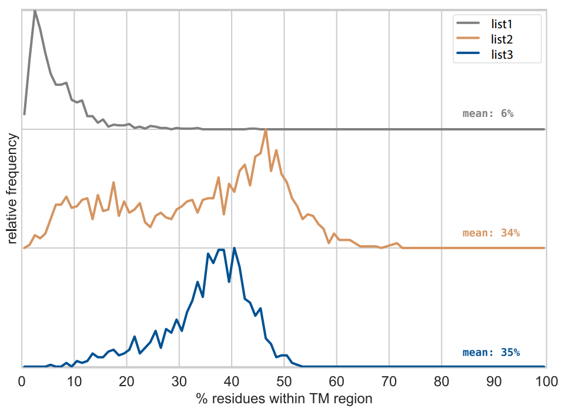

# korbinian #
Bioinformatic sequence analysis of membrane proteins

### What is this repository for? ###

* Parsing of UniProt flatfiles
* Downloading homologues (primarily with SIMAP)
* Parsing BLAST-like XML files
* Analysis of protein sequences
* Automated figure creation

### License ###

* korbinian is released under the permissive MIT licence

### Credits ###

* Mark Teese
(for contact details, see the Langosch lab website at TUM)
* Martin Ortner
* Shenger Wang
* Rimma Jenske 

### Citation ###

* scientific publication to be added
* currently cited as "the korbinian python package (Mark Teese, Technical University of Munich)"

### Examples ###

